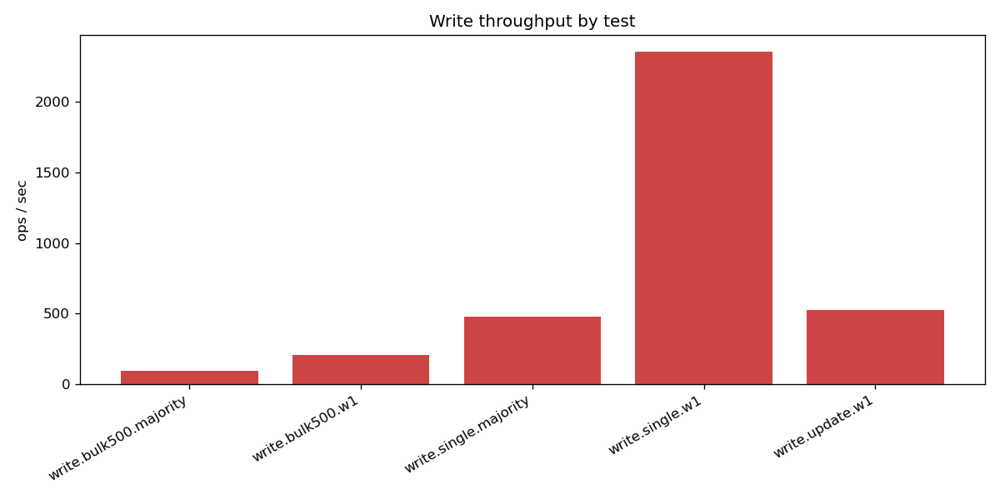
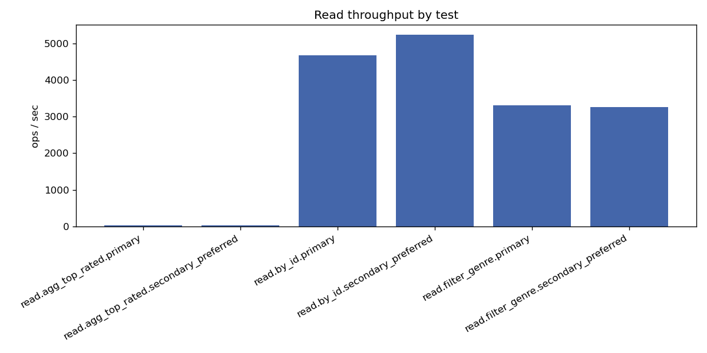
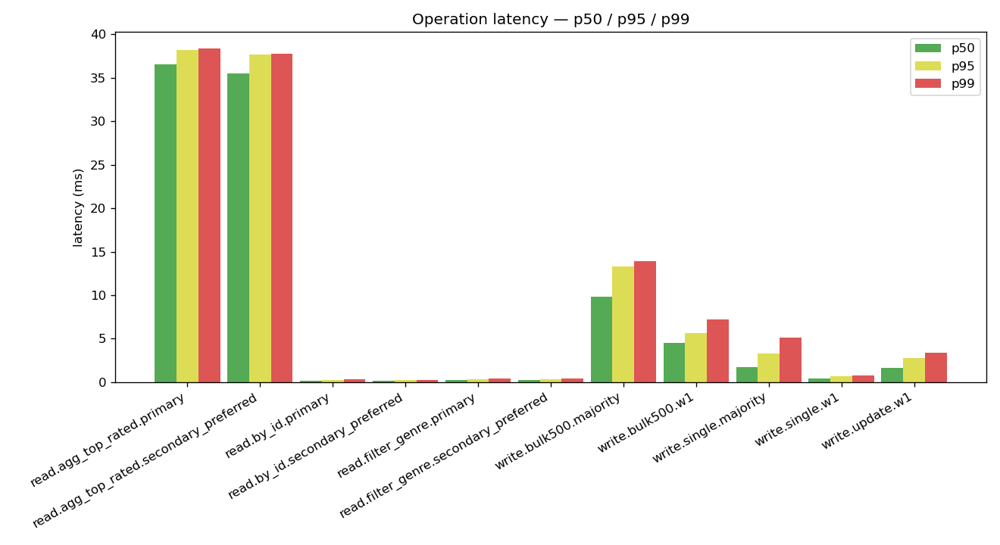
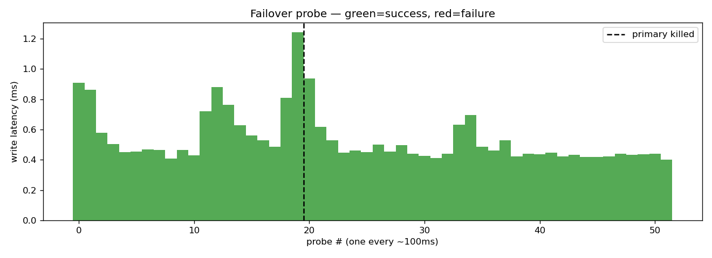

# MongoDB Replica-Set Benchmark — Phase 2

_Generated: 2026-05-19T14:47:17_

## 1. Setup

- Replica set: `rs0` (mongo1 / mongo2 / mongo3)
- Connection used: `replica-set client`
- Dataset: MovieLens latest-small (movies=9742, ratings_seeded=95836, ratings_holdout=5000, tags=3683)

## 2. Write performance

| test | n | total (s) | ops/s | mean | p50 | p95 | p99 | max | errors |
| --- | ---: | ---: | ---: | ---: | ---: | ---: | ---: | ---: | ---: |
| `write.bulk500.majority` | 5 | 0.05 | 95.6 | 10.36 ms | 9.79 ms | 13.30 ms | 13.94 ms | 14.10 ms | 0 |
| `write.bulk500.w1` | 20 | 0.10 | 205.7 | 4.69 ms | 4.52 ms | 5.64 ms | 7.19 ms | 7.57 ms | 0 |
| `write.single.majority` | 125 | 0.26 | 479.8 | 2.08 ms | 1.71 ms | 3.32 ms | 5.13 ms | 5.89 ms | 0 |
| `write.single.w1` | 500 | 0.21 | 2354.1 | 423 µs | 401 µs | 661 µs | 795 µs | 1.38 ms | 0 |
| `write.update.w1` | 500 | 0.95 | 526.7 | 1.90 ms | 1.69 ms | 2.76 ms | 3.38 ms | 5.63 ms | 0 |

## 3. Read performance

| test | n | total (s) | ops/s | mean | p50 | p95 | p99 | max | errors |
| --- | ---: | ---: | ---: | ---: | ---: | ---: | ---: | ---: | ---: |
| `read.agg_top_rated.primary` | 20 | 0.73 | 27.4 | 36.44 ms | 36.50 ms | 38.16 ms | 38.33 ms | 38.37 ms | 0 |
| `read.agg_top_rated.secondary_preferred` | 20 | 0.72 | 27.9 | 35.82 ms | 35.52 ms | 37.68 ms | 37.79 ms | 37.82 ms | 0 |
| `read.by_id.primary` | 500 | 0.11 | 4676.0 | 213 µs | 205 µs | 296 µs | 373 µs | 494 µs | 0 |
| `read.by_id.secondary_preferred` | 500 | 0.10 | 5238.5 | 190 µs | 177 µs | 254 µs | 291 µs | 321 µs | 0 |
| `read.filter_genre.primary` | 500 | 0.15 | 3311.0 | 300 µs | 297 µs | 369 µs | 401 µs | 663 µs | 0 |
| `read.filter_genre.secondary_preferred` | 500 | 0.15 | 3262.9 | 305 µs | 299 µs | 368 µs | 399 µs | 437 µs | 0 |

## 4. Failover

- Primary killed: **mongo3**
- Mode: automated (docker stop)
- Write downtime: **0.00 s** (time from kill to first successful write)
- Probes: 52 total, 52 succeeded, 0 failed

## 5. Charts

## 6. Notes

- Latency reported is wall-clock time around each driver call.
- `w1` = WriteConcern(w=1), `majority` = WriteConcern(w='majority').
- `primary` reads go to the primary; `secondary_preferred` reads are served from a secondary when one is available.
- Raw per-op timings are in `results.csv` if you want to compute different statistics.
